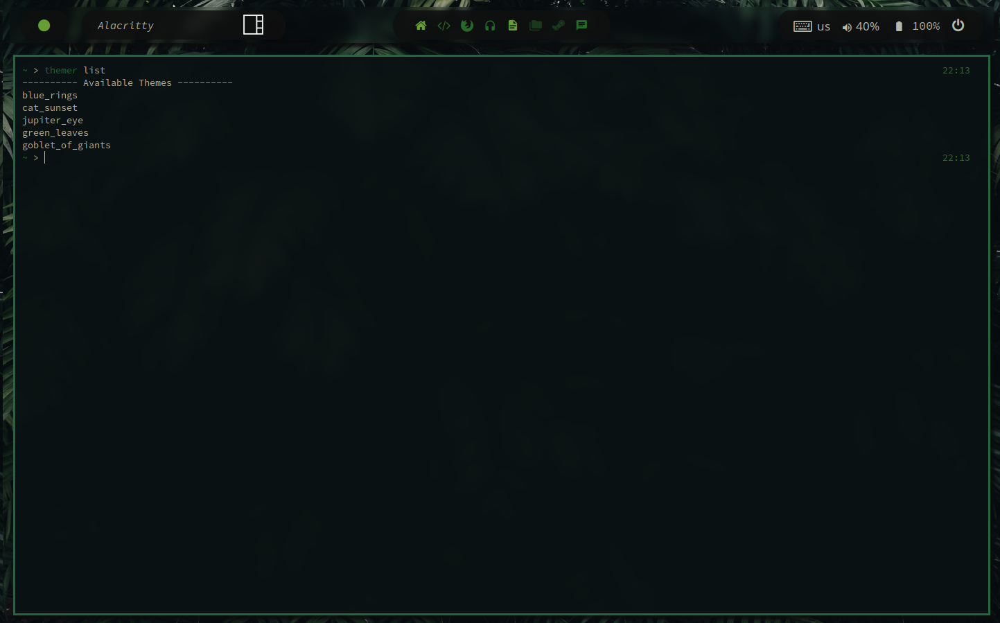
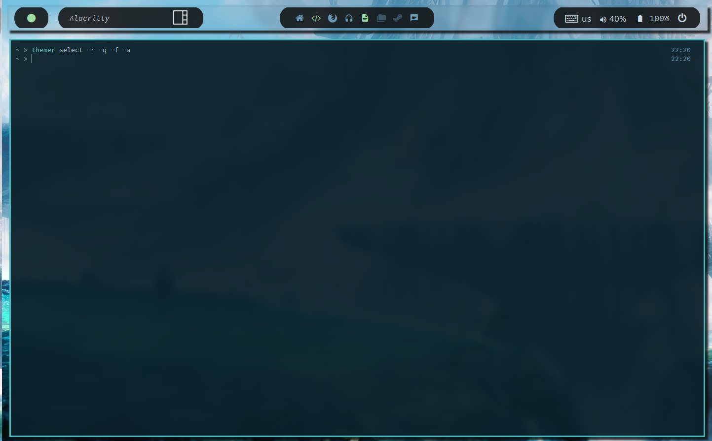

# Rs-Themer

A simple cli programm to manage your pywal themes.

## Installation

You can either clone this repo and run it with 
```
cargo run -- [subcommand] [args]
``` 
or build the binary yourself with 
```
cargo build --release
```
and run it from the target/releases folder

## Tab Completions

To enable tab completions for the command line tool, you need to source `themer-tabcompletions` on each new session (or source it
inside your .bashrc/.zshrc) and have the compiled binary `themer` somewhere in your path (like `~/.local/bin`)

## Compatibility

It obviously requires pywal to be installed.
Other than that:
- It's compatible with [pywalfox](https://github.com/Frewacom/pywalfox), just pass the -f flag when selecting a theme.
- If you want to also reload qtile so it uses the updated colors, pass the -q flag when selecting a theme.

## Screenshots




## USAGE:
```
themer <SUBCOMMAND>
```
```
FLAGS:
    -h, --help       Prints help information
    -V, --version    Prints version information

SUBCOMMANDS:
    add       <image-path> add new theme to selections
    help      Prints this message or the help of the given subcommand(s)
    list      list available themes
    remove    [theme name] remove theme from selections
    select    change theme to selected
```

### Add

add new theme(s) to selections 

```
themer add <image-path> [theme-name]

ARGS:
    <image-path>    image path
```

### Remove

remove theme(s) from selections
```
themer remove [theme-name]

ARGS:
    <theme-name>    theme name
```

### Select


change to selected theme

```
themer select [FLAGS] [theme-name]

FLAGS:
    -a               reload alacritty
    -h, --help       Prints help information
    -f               reload pywalfox
    -q               reload qtile
    -r               select random theme
    -V, --version    Prints version information

ARGS:
    <theme-name>    theme name
```

### List

list available themes

```
themer list
```