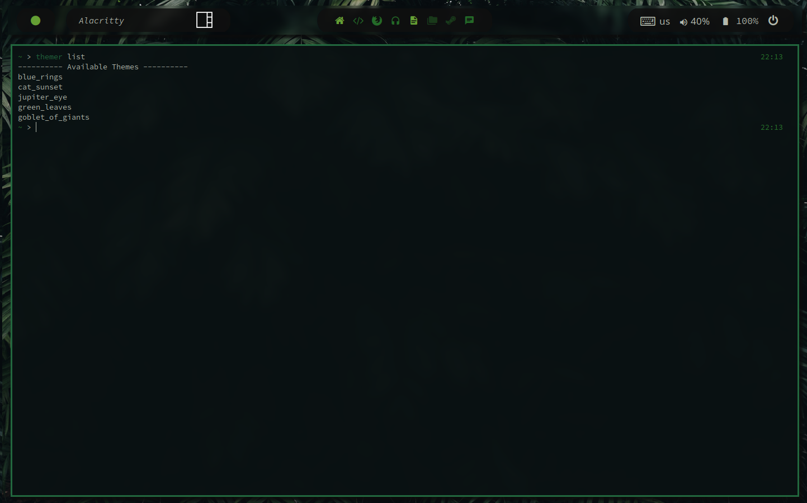
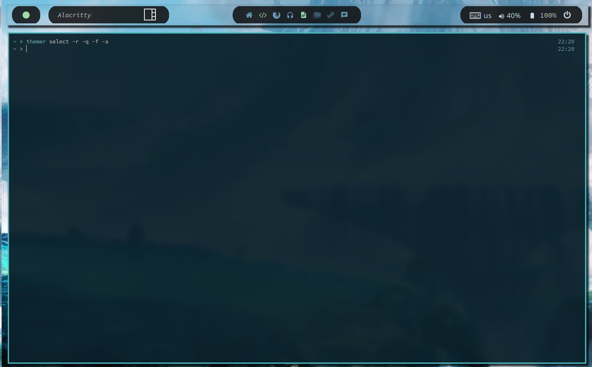

# wlr

A small Rust CLI that manages a collection of wallpapers as themes for [wallust](https://codeberg.org/explosion-mental/wallust).
Add images once, then switch between them (or pick one at random) and wallust regenerates your color scheme.

## Requirements

- [wallust](https://codeberg.org/explosion-mental/wallust) in your `PATH`
- `XDG_CONFIG_HOME` and `XDG_CACHE_HOME` environment variables set

## Installation

```sh
cargo build --release
cp target/release/wlr ~/.local/bin/
```

Or run it directly from the repo with `cargo run -- <SUBCOMMAND> [ARGS]`.

### NixOS (flake)

The flake builds `wlr`, puts `wallust` on its `PATH` and installs bash/zsh/fish completions.

Try it without installing:

```sh
nix run github:HliasOuzounis/Rs-themer -- list
```

Install it via your system flake:

```nix
# flake.nix
{
  inputs.wlr.url = "github:HliasOuzounis/Rs-themer";

  outputs = { nixpkgs, wlr, ... }: {
    nixosConfigurations.<hostname> = nixpkgs.lib.nixosSystem {
      modules = [
        ({ pkgs, ... }: {
          environment.systemPackages = [ wlr.packages.${pkgs.stdenv.hostPlatform.system}.default ];
        })
      ];
    };
  };
}
```

With home-manager, add the same package to `home.packages` instead.

For development, `nix develop` gives a shell with cargo, rustc, rust-analyzer and wallust.

## Shell completions

The Nix package installs these automatically. Otherwise, generate them with the binary itself (bash, zsh, fish, elvish, powershell):

```sh
# zsh
wlr completions zsh > "${fpath[1]}/_wlr"

# bash
wlr completions bash > ~/.local/share/bash-completion/completions/wlr

# fish
wlr completions fish > ~/.config/fish/completions/wlr.fish
```

## Usage

```
wlr <COMMAND>

Commands:
  add     Add new theme
  remove  Remove theme
  select  Change theme
  list    List available themes
  help    Print this message or the help of the given subcommand(s)
```

### add

Add one or more images as themes. The theme name is the image file name without its extension. Only `jpg` and `png` are accepted.

```sh
wlr add [-s|--set-theme] <IMAGE_PATH>...
```

- `-s, --set-theme` — apply the theme right away (only when adding a single image)

### remove

```sh
wlr remove <THEME_NAME>...
```

### select

```sh
wlr select <THEME_NAME>
wlr select --random
```

- `-r, --random` — pick a random saved theme

Runs `wallust run <image>` for the chosen theme.

### list

List saved themes. The active one (read from `$XDG_CACHE_HOME/wallust/wallpaper`) is marked with `*`.

```sh
wlr list
```

## Files

| Path | Purpose |
| --- | --- |
| `$XDG_CONFIG_HOME/wallust/themes.conf` | Saved themes, one `name:/absolute/image/path` per line |
| `$XDG_CACHE_HOME/wallust/wallpaper` | Current wallpaper, used by `list` to mark the active theme |

## Screenshots



